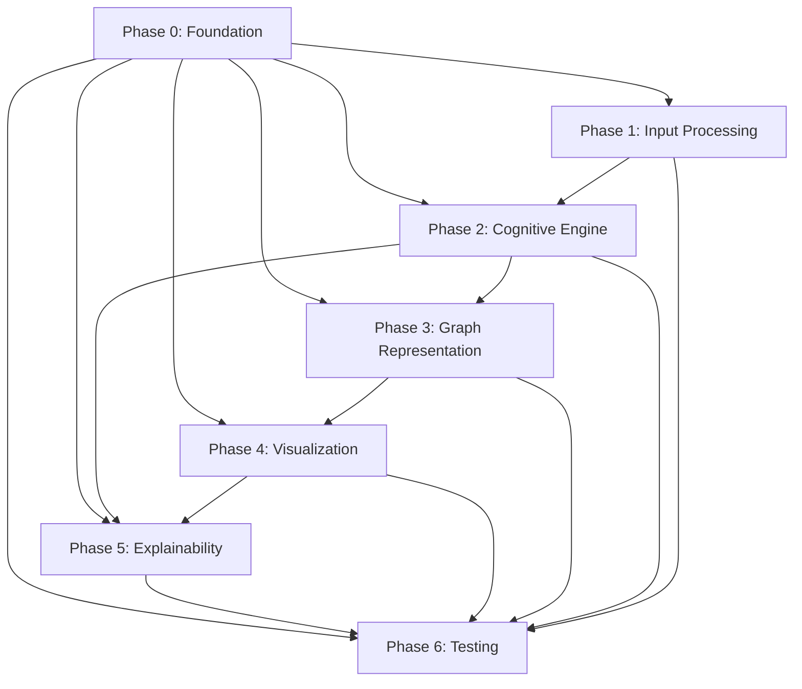

# Phase Overview - Cognitive Fabric Visualizer

## Project Phase Map

This document provides a comprehensive overview of all project phases, their dependencies, timelines, and interconnections. Each phase follows SPARC methodology and London School TDD principles.

## Phase Summary Table

| Phase | Name | Duration | Tasks | Target Performance | Key Dependencies |
|-------|------|----------|-------|-------------------|------------------|
| 0 | Foundation & Environment | 2 weeks | 000-099 | Dev environment ready | None |
| 1 | Input Processing Module | 3 weeks | 100-199 | 90% intent recognition | Phase 0 |
| 2 | Cognitive Decomposition Engine | 6 weeks | 200-299 | 95% precision decomposition | Phase 0, 1 |
| 3 | Graph Representation Layer | 4 weeks | 300-399 | 90% prediction accuracy | Phase 0, 2 |
| 4 | Visualization Engine | 6 weeks | 400-499 | 240 FPS rendering | Phase 0, 3 |
| 5 | Explainability Module | 4 weeks | 500-599 | 95% user validation | Phase 0, 2, 4 |
| 6 | Testing & Integration | 3 weeks | 600-699 | 80% coverage | All previous phases |

**Total Project Duration**: 28 weeks (~7 months)

## Detailed Phase Breakdowns

### Phase 0: Foundation & Environment Setup
**Timeline**: Weeks 1-2
**Primary Objective**: Establish robust development infrastructure

#### Key Milestones
- **Week 1**: Development environment, version control, CI/CD pipeline
- **Week 2**: Testing framework, database setup, API scaffolding

#### Critical Success Factors
- All developers can run complete environment locally
- Automated testing pipeline is functional
- Code quality standards are enforced
- Documentation framework is established

#### Integration Points
- Provides foundation for all subsequent phases
- Establishes coding standards and practices
- Creates reusable testing infrastructure

### Phase 1: Input Processing Module
**Timeline**: Weeks 3-5
**Primary Objective**: Build multi-modal conversation processing pipeline

#### Core Components
1. **Rasa Framework Integration** - Dialogue intent recognition
2. **Conversation Segmentation** - Turn detection and boundary identification
3. **Multi-modal Processing** - Text, audio, and visual input handling
4. **Preprocessing Pipeline** - Normalization and feature extraction

#### Research-Based Targets
- **Intent Recognition**: 90% precision (vs 94% research target)
- **Segmentation Accuracy**: 92% for complex dialogues
- **Multi-modal Context**: 25% improvement over text-only
- **Processing Speed**: <2 seconds for 10-minute conversations

#### Dependencies
- **Phase 0**: Development environment and testing infrastructure
- **External APIs**: Rasa, speech-to-text, video processing services

### Phase 2: Cognitive Decomposition Engine
**Timeline**: Weeks 6-11 (6 weeks)
**Primary Objective**: Implement ensemble LLM architecture for cognitive analysis

#### Cognitive Dimension Analyzers
1. **Factual Retrieval Detector** (Target: 92% accuracy)
2. **Logical Inference Mapper** (Target: 85% precision)
3. **Creative Synthesis Identifier** (Target: 0.60 ROUGE-L)
4. **Meta-Cognition Analyzer** (Target: 0.96 F1-score)

#### Ensemble Architecture
- **Specialized Models**: One model per cognitive dimension
- **Meta-Learner**: Arbitrates between model outputs
- **Neuro-Symbolic Integration**: Rule-based validation
- **Real-time Processing**: Sub-second analysis capability

#### Research-Based Performance
- **Ensemble Precision**: 95% (vs 88% single LLM)
- **Meta-Cognitive Detection**: 0.96 F1-score (multi-modal)
- **Processing Speed**: <5 seconds per conversation
- **Confidence Scoring**: Reliable uncertainty quantification

#### Dependencies
- **Phase 0**: Core infrastructure and API framework
- **Phase 1**: Processed conversation input
- **External Services**: OpenAI/Claude APIs, knowledge graphs

### Phase 3: Graph Representation Layer
**Timeline**: Weeks 12-15 (4 weeks)
**Primary Objective**: Build dynamic graph neural network for cognitive relationships

#### Core Architecture
1. **Dynamic Graph Neural Network (DGNN)** - Temporal relationship modeling
2. **Knowledge Graph Integration** - Entity and concept grounding
3. **Attention Mechanisms** - Cognitive thread importance weighting
4. **Predictive Modeling** - Cognitive evolution forecasting

#### Graph Schema
- **Nodes**: Cognitive elements (facts, inferences, syntheses, meta-thoughts)
- **Edges**: Temporal, causal, and semantic relationships
- **Attributes**: Confidence scores, timestamps, intensity measures
- **Layers**: Cognitive dimension separation with cross-connections

#### Research-Based Targets
- **Prediction Accuracy**: 90% for cognitive thread evolution
- **Temporal Modeling**: 85% accuracy for dynamic relationships
- **Knowledge Integration**: 90% user comprehension
- **Update Speed**: Real-time graph modifications (<1 second)

#### Dependencies
- **Phase 0**: Database infrastructure and graph storage
- **Phase 2**: Cognitive decomposition output
- **External Services**: Neo4j, knowledge graph APIs

### Phase 4: Visualization Engine
**Timeline**: Weeks 16-21 (6 weeks)
**Primary Objective**: Create WebGPU-powered 3D visualization system

#### Rendering Pipeline
1. **WebGPU Integration** - High-performance 3D rendering
2. **Force-Directed Layouts** - Dynamic graph positioning
3. **Interactive Controls** - User navigation and exploration
4. **Multi-layer Rendering** - Cognitive dimension visualization

#### Performance Requirements
- **Frame Rate**: 240 FPS on high-end hardware
- **Node Capacity**: 1000+ cognitive elements without performance loss
- **Memory Efficiency**: Smooth interaction with large graphs
- **Cross-Platform**: Browser compatibility and responsive design

#### User Experience Features
- **3D Navigation**: Zoom, pan, rotate cognitive space
- **Temporal Playback**: Time-based reasoning evolution
- **Filtering System**: Focus on specific cognitive dimensions
- **Export Capabilities**: PNG, SVG, JSON output formats

#### Dependencies
- **Phase 0**: Frontend build system and web server
- **Phase 3**: Graph data structure and API endpoints
- **External Libraries**: Three.js, Babylon.js, D3.js

### Phase 5: Explainability Module
**Timeline**: Weeks 22-25 (4 weeks)
**Primary Objective**: Implement neuro-symbolic AI for transparent reasoning

#### Transparency Features
1. **Interactive Feedback Loops** - User validation and correction
2. **Rule Generation** - Symbolic explanations for classifications
3. **Confidence Visualization** - Uncertainty representation
4. **Alternative Interpretations** - Multiple reasoning paths

#### Trust-Building Mechanisms
- **Human-in-the-Loop**: Users can refine classifications
- **Rule Transparency**: Clear explanations for AI decisions
- **Attribution Highlighting**: Key phrases triggering classifications
- **Validation Interface**: Direct user feedback integration

#### Research-Based Targets
- **User Validation**: 95% satisfaction with explanations
- **Trust Improvement**: 40% increase over baseline
- **Rule Accuracy**: Reliable symbolic reasoning generation
- **Interface Usability**: Intuitive explanation navigation

#### Dependencies
- **Phase 0**: Frontend framework and API infrastructure
- **Phase 2**: Cognitive decomposition models and confidence scores
- **Phase 4**: Visualization interface for explanation overlays

### Phase 6: Testing & Integration
**Timeline**: Weeks 26-28 (3 weeks)
**Primary Objective**: Comprehensive validation and deployment preparation

#### Testing Strategy
1. **Unit Testing** - Component-level validation (80% coverage)
2. **Integration Testing** - Cross-component functionality
3. **End-to-End Testing** - Complete user workflows
4. **Performance Testing** - Load and stress testing

#### Validation Criteria
- **Performance Benchmarks**: All targets meet research standards
- **User Acceptance**: 90% satisfaction with core features
- **System Reliability**: 99.5% uptime for production
- **Security Validation**: No critical vulnerabilities

#### Deployment Preparation
- **Production Environment**: Scalable cloud infrastructure
- **Monitoring Systems**: Performance and error tracking
- **Documentation**: Complete user and developer guides
- **Training Materials**: User onboarding and support resources

## Critical Path Analysis

### Primary Critical Path
Phase 0 → Phase 1 → Phase 2 → Phase 3 → Phase 4 → Phase 6

### Parallel Development Opportunities
- **Phase 5** can start in parallel with **Phase 4** (after Phase 2)
- **Frontend development** (Phase 4) can begin with mock data before Phase 3 completion
- **Testing infrastructure** (Phase 6) preparation can start during Phase 4

### Risk Mitigation Timeline
- **Week 4**: Phase 1 checkpoint - validate input processing pipeline
- **Week 8**: Phase 2 checkpoint - verify cognitive decomposition accuracy
- **Week 13**: Phase 3 checkpoint - confirm graph prediction performance
- **Week 18**: Phase 4 checkpoint - validate rendering performance
- **Week 23**: Phase 5 checkpoint - test explainability interfaces
- **Week 27**: Final integration checkpoint - complete system validation

## Integration Dependencies Map

## Resource Allocation Strategy

### Team Structure Recommendations
- **Phase 0**: DevOps + Backend + Frontend (2-3 developers)
- **Phase 1**: NLP/ML + Backend (2-3 specialists)
- **Phase 2**: ML Engineers + Cognitive Science (3-4 specialists)
- **Phase 3**: Graph ML + Data Science (2-3 specialists)
- **Phase 4**: Frontend + Graphics Programming (2-3 developers)
- **Phase 5**: AI Ethics + UX + ML (2-3 specialists)
- **Phase 6**: QA + DevOps + Technical Writing (2-3 specialists)

### Budget Considerations
- **Infrastructure**: Cloud computing, GPUs, databases (Phase 0-6)
- **API Costs**: LLM usage, knowledge graph access (Phase 2-5)
- **Specialized Tools**: Graph databases, visualization libraries (Phase 3-4)
- **Testing Resources**: Performance testing, user studies (Phase 6)

## Quality Gates and Milestones

### Phase Completion Criteria
Each phase must meet these criteria before proceeding:
1. **Functional Requirements**: All features working as specified
2. **Performance Targets**: Research-based benchmarks achieved
3. **Test Coverage**: Minimum coverage standards met
4. **Documentation**: Complete and up-to-date documentation
5. **Integration Review**: Successful cross-phase integration tests

### Go/No-Go Decision Points
- **After Phase 1**: Input processing quality validated
- **After Phase 2**: Cognitive decomposition accuracy confirmed
- **After Phase 3**: Graph prediction performance verified
- **After Phase 4**: Visualization rendering performance achieved
- **After Phase 5**: User validation and trust metrics met

## Success Metrics Summary

### Technical Metrics
- **Cognitive Accuracy**: Meet or exceed research targets
- **System Performance**: Sub-second processing, 240 FPS rendering
- **Reliability**: 99.5% uptime, <1% error rate
- **Scalability**: Support concurrent users, large conversations

### User Metrics
- **Comprehension**: 90% understand cognitive visualizations
- **Trust**: 95% validate AI explanations
- **Satisfaction**: 4.0/5.0 overall rating
- **Task Success**: 90% achieve goals using the system

### Business Metrics
- **Adoption**: Active user growth and retention
- **Performance**: System reliability and availability
- **Impact**: Measurable improvements in problem-solving outcomes

---

**Navigation**: Return to [MASTER_PLAN.md](MASTER_PLAN.md) or proceed to individual phase documentation for detailed implementation guidance.