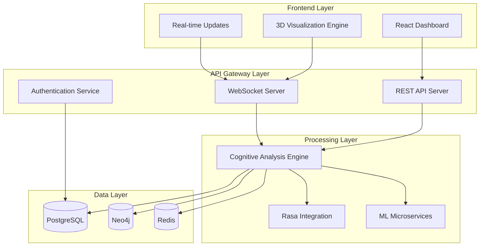
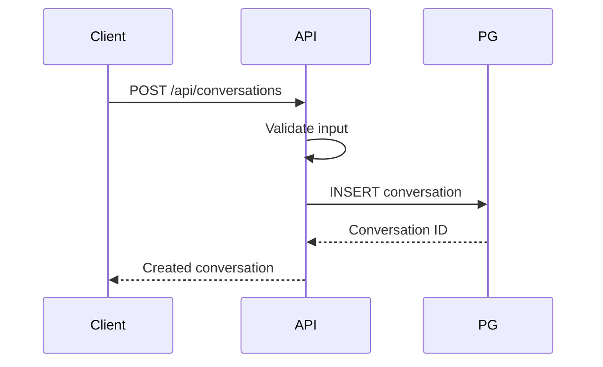
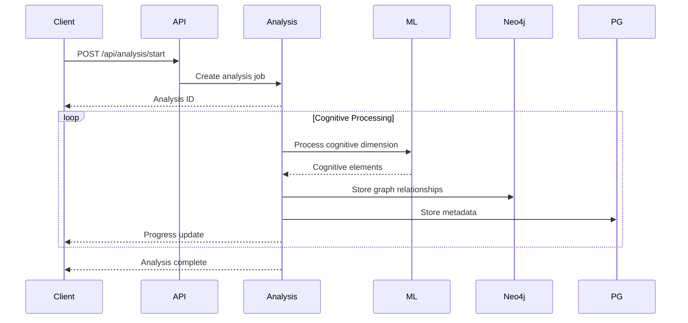

# Cognitive Fabric Visualizer - Architecture Documentation

## Overview

The Cognitive Fabric Visualizer is a sophisticated system that transforms conversational data into multi-dimensional cognitive visualizations. The architecture follows a microservices approach with real-time processing capabilities and high-performance rendering.

## System Architecture



## Frontend Architecture

### Component Structure
```
src/client/
├── components/
│   ├── CognitiveVisualization3D.tsx     # Main 3D visualization
│   ├── CognitiveTimeline.tsx             # Timeline visualization
│   ├── CognitiveDashboard.tsx            # Main dashboard
│   └── ...
├── services/
│   ├── apiService.ts                     # API client
│   └── webSocketService.ts               # Real-time client
├── types/
│   └── cognitive.ts                      # Type definitions
└── App.tsx                               # Root component
```

### Key Technologies
- **React 18+**: Component-based UI framework
- **TypeScript**: Type-safe development
- **Three.js**: 3D graphics rendering
- **React Three Fiber**: React renderer for Three.js
- **D3.js**: Data visualization library
- **WebSockets**: Real-time communication

### Performance Optimizations
- **WebGPU/WebGL**: Hardware-accelerated rendering
- **Adaptive Quality**: Dynamic resolution adjustment
- **Memory Management**: Efficient node/edge pooling
- **Frame Rate Targeting**: 240 FPS performance goal

## Backend Architecture

### Microservices Design
```
src/server/
├── routes/           # API endpoints
├── services/         # Business logic
├── middleware/       # Request handling
├── config/          # Configuration
├── utils/           # Utility functions
└── types/           # Shared types
```

### Core Services

#### 1. Authentication Service
- JWT-based authentication
- Role-based access control
- Token refresh mechanism
- Session management

#### 2. Conversation Service
- Conversation CRUD operations
- Transcript management
- Metadata handling
- Search and filtering

#### 3. Analysis Service
- Cognitive decomposition engine
- Four-dimensional analysis pipeline
- Real-time progress tracking
- Result caching

#### 4. Visualization Service
- 3D graph generation
- Multi-format rendering
- Export functionality
- Performance monitoring

#### 5. WebSocket Service
- Real-time event broadcasting
- Connection management
- Client state synchronization
- Heartbeat monitoring

### API Design Principles

#### RESTful Endpoints
```
GET    /api/conversations              # List conversations
POST   /api/conversations              # Create conversation
GET    /api/conversations/:id          # Get conversation
PUT    /api/conversations/:id          # Update conversation
DELETE /api/conversations/:id          # Delete conversation

POST   /api/analysis/start             # Start analysis
GET    /api/analysis/:id/status        # Get analysis status
GET    /api/analysis/:id/result        # Get analysis result
POST   /api/analysis/:id/cancel        # Cancel analysis

GET    /api/visualizations/:convId     # Get visualization
PUT    /api/visualizations/:vizId     # Update visualization
DELETE /api/visualizations/:vizId     # Delete visualization
```

#### WebSocket Events
```typescript
// Client → Server
{
  type: "subscribe",
  data: { conversationId: string, analysisId?: string }
}

// Server → Client
{
  type: "analysis_progress",
  data: { progress: number, currentStep: string }
}

{
  type: "cognitive_element_added",
  data: { element: CognitiveElement }
}
```

## Data Architecture

### Database Schema

#### PostgreSQL (Metadata)
```sql
users                  -- User accounts and preferences
conversations          -- Conversation metadata
transcripts           -- Conversation transcripts
cognitive_analyses    -- Analysis results
cognitive_elements    -- Individual cognitive elements
visualizations        -- Generated visualizations
exports               -- Export jobs and results
```

#### Neo4j (Graph Data)
```cypher
(:CognitiveElement)-[:COGNITIVE_RELATION]->(:CognitiveElement)
(:Conversation)-[:HAS_ELEMENT]->(:CognitiveElement)
(:User)-[:OWNS]->(:Conversation)
```

#### Redis (Caching)
- **Session Cache**: User sessions and tokens
- **Analysis Cache**: In-progress analysis results
- **Visualization Cache**: Pre-rendered visualizations
- **Rate Limiting**: API request throttling

### Data Flow

#### 1. Conversation Creation


#### 2. Cognitive Analysis


## Cognitive Analysis Engine

### Four-Dimensional Pipeline

#### 1. Factual Retrieval Processing
```typescript
interface FactualRetrievalProcessor {
  extractEntities(text: string): Entity[]
  extractSemanticRoles(text: string): SemanticRole[]
  verifyFacts(entities: Entity[]): VerificationResult[]
  calculateConfidence(facts: Fact[]): number
}
```

#### 2. Logical Inference Processing
```typescript
interface LogicalInferenceProcessor {
  extractArguments(text: string): Argument[]
  identifyPremises(argument: Argument): Premise[]
  deriveConclusions(premises: Premise[]): Conclusion[]
  calculateLogicalStrength(argument: Argument): number
}
```

#### 3. Creative Synthesis Processing
```typescript
interface CreativeSynthesisProcessor {
  identifyNovelConcepts(text: string): Concept[]
  generateCounterfactuals(concepts: Concept[]): Counterfactual[]
  calculateNoveltyScore(synthesis: Synthesis): number
  assessCreativity(elements: CognitiveElement[]): number
}
```

#### 4. Meta-Cognition Processing
```typescript
interface MetaCognitionProcessor {
  detectSelfCorrection(text: string): SelfCorrection[]
  identifyPlanningMarkers(text: string): PlanningMarker[]
  calculateCognitiveLoad(elements: CognitiveElement[]): number
  assessSelfAwareness(metacognition: MetaCognition): number
}
```

### Accuracy Validation

#### Target Metrics
- **Factual Retrieval**: 92% accuracy threshold
- **Logical Inference**: 85% precision threshold
- **Creative Synthesis**: 0.60 ROUGE-L threshold
- **Meta-Cognition**: 0.96 F1-score threshold

#### Validation Process
```typescript
interface AccuracyValidator {
  validateFactualAccuracy(elements: FactualElement[]): boolean
  validateLogicalPrecision(arguments: LogicalArgument[]): boolean
  validateCreativityScore(synthesis: CreativeSynthesis): boolean
  validateMetacognitionF1(metacognition: MetaCognition): boolean

  overallAccuracy(result: CognitiveAnalysisResult): number
}
```

## Visualization Engine

### 3D Rendering Pipeline

#### Scene Graph Structure
```typescript
interface SceneGraph {
  camera: PerspectiveCamera
  lights: Light[]
  nodes: CognitiveNode3D[]
  edges: CognitiveEdge3D[]
  controls: OrbitControls
  effects: PostProcessingEffects
}
```

#### Force-Directed Layout Algorithm
```typescript
interface ForceSimulation {
  nodes: Node[]
  edges: Edge[]
  forces: {
    attraction: (source: Node, target: Node) => Vector3
    repulsion: (node1: Node, node2: Node) => Vector3
    centering: (node: Node) => Vector3
  }

  update(deltaTime: number): void
}
```

#### Performance Optimizations
- **Instanced Rendering**: GPU-efficient node rendering
- **Level of Detail**: Adaptive quality based on distance
- **Occlusion Culling**: Skip non-visible elements
- **Memory Pooling**: Reuse geometry and materials

### Real-time Updates

#### WebSocket Integration
```typescript
class VisualizationWebSocket {
  subscribeToConversation(id: string): void
  handleCognitiveElement(element: CognitiveElement): void
  handleAnalysisProgress(progress: Progress): void
  updateVisualizationRealtime(): void
}
```

#### State Synchronization
```typescript
interface VisualizationState {
  selectedNodes: Set<string>
  cameraPosition: Vector3
  filters: DimensionFilter[]
  playbackTime: number
  isPlaying: boolean
}
```

## Security Architecture

### Authentication & Authorization

#### JWT Implementation
```typescript
interface JWTPayload {
  userId: string
  email: string
  role: UserRole
  iat: number
  exp: number
}

interface UserRoles {
  ADMIN: 'admin'
  RESEARCHER: 'researcher'
  ANALYST: 'analyst'
  VIEWER: 'viewer'
}
```

#### API Security
- **Rate Limiting**: Request throttling per user
- **Input Validation**: Joi schema validation
- **SQL Injection Prevention**: Parameterized queries
- **XSS Protection**: Input sanitization
- **CORS Configuration**: Secure cross-origin settings

### Data Protection

#### Encryption
- **Data at Rest**: PostgreSQL encryption at rest
- **Data in Transit**: TLS 1.3 for all communications
- **Secrets Management**: Environment variable encryption
- **Session Security**: Secure cookie settings

#### Privacy Controls
- **Data Anonymization**: Remove PII from cognitive analysis
- **Access Logging**: Comprehensive audit trails
- **Data Retention**: Configurable retention policies
- **User Rights**: GDPR compliance features

## Performance Architecture

### API Performance

#### Response Time Targets
- **Health Check**: <10ms
- **Authentication**: <50ms
- **Conversation CRUD**: <100ms
- **Analysis Start**: <200ms
- **Visualization Fetch**: <500ms

#### Caching Strategy
```typescript
interface CacheStrategy {
  apiCache: {
    ttl: 300        // 5 minutes
    maxSize: 1000    // entries
    eviction: 'lru'  // Least Recently Used
  }

  analysisCache: {
    ttl: 3600       // 1 hour
    warmup: true     // Preload common analyses
  }

  visualizationCache: {
    ttl: 1800       // 30 minutes
    compression: true
  }
}
```

### Database Performance

#### Connection Pooling
```typescript
interface DatabasePool {
  postgres: {
    max: 20          // Maximum connections
    min: 5           // Minimum connections
    idleTimeout: 30000 // 30 seconds
  }

  neo4j: {
    maxConnectionPoolSize: 50
    connectionAcquisitionTimeout: 60000
  }
}
```

#### Query Optimization
- **Indexing Strategy**: Optimized indexes for common queries
- **Query Planning**: EXPLAIN ANALYZE monitoring
- **Batch Operations**: Bulk inserts and updates
- **Connection Reuse**: Persistent connections

### Frontend Performance

#### Rendering Optimization
- **Frame Rate Targeting**: 240 FPS goal
- **Adaptive Quality**: Dynamic based on performance
- **Memory Management**: Efficient garbage collection
- **Lazy Loading**: On-demand component loading

#### Bundle Optimization
```typescript
interface BundleConfig {
  optimization: {
    splitChunks: {
      vendors: true
      common: true
      runtime: true
    }
  }

  performance: {
    maxAssetSize: 250000
    maxEntrypointSize: 250000
  }
}
```

## Monitoring & Observability

### Application Metrics

#### Performance Metrics
```typescript
interface PerformanceMetrics {
  api: {
    responseTime: number
    errorRate: number
    throughput: number
  }

  database: {
    queryTime: number
    connectionPool: PoolMetrics
    indexUsage: IndexStats
  }

  visualization: {
    fps: number
    renderTime: number
    memoryUsage: number
    nodeCount: number
  }
}
```

#### Health Checks
```typescript
interface HealthCheck {
  status: 'healthy' | 'degraded' | 'unhealthy'
  services: {
    database: ServiceHealth
    cache: ServiceHealth
    external: ServiceHealth
  }
  metrics: SystemMetrics
}
```

### Logging Strategy

#### Structured Logging
```typescript
interface LogEntry {
  level: 'error' | 'warn' | 'info' | 'debug'
  message: string
  timestamp: Date
  requestId: string
  userId?: string
  metadata: Record<string, any>
}
```

#### Log Aggregation
- **Centralized Logging**: ELK stack integration
- **Error Tracking**: Sentry error monitoring
- **Performance Tracking**: APM integration
- **Audit Logging**: Security event logging

## Deployment Architecture

### Container Orchestration

#### Docker Configuration
```dockerfile
# Multi-stage build for optimization
FROM node:18-alpine AS builder
FROM node:18-alpine AS runtime

# Health checks
HEALTHCHECK --interval=30s --timeout=3s --start-period=5s --retries=3
CMD curl -f http://localhost:3001/health || exit 1
```

#### Kubernetes Deployment
```yaml
apiVersion: apps/v1
kind: Deployment
metadata:
  name: cognitive-fabric-api
spec:
  replicas: 3
  strategy:
    type: RollingUpdate
    rollingUpdate:
      maxSurge: 1
      maxUnavailable: 0
```

### Infrastructure Scaling

#### Horizontal Scaling
- **API Servers**: Auto-scaling based on CPU/memory
- **Database**: Read replicas for read-heavy workloads
- **Cache**: Redis clustering for high availability
- **WebSockets**: Sticky sessions for connection persistence

#### Vertical Scaling
- **GPU Acceleration**: For ML processing tasks
- **Memory Optimization**: For large conversation analysis
- **Storage Scaling**: Automated volume expansion

This architecture ensures the Cognitive Fabric Visualizer can handle real-time cognitive analysis at scale while maintaining high performance and reliability.