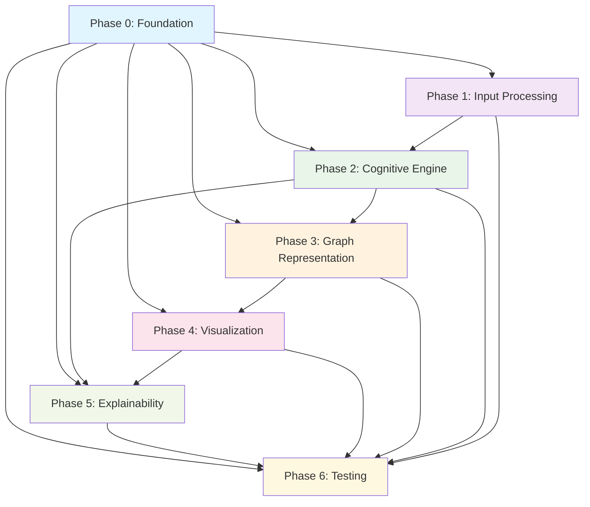

# Integration Points and Dependencies - Cognitive Fabric Visualizer

## Overview

This document defines all integration points, dependencies, and interfaces between the seven phases of the Cognitive Fabric Visualizer project. Understanding these connections is critical for planning, parallel development, and risk mitigation.

## Phase Dependency Matrix



## Critical Integration Points

### 1. Foundation Layer Integrations (Phase 0)

#### Database Infrastructure
**Provided by**: Phase 0 (Tasks 040-059)
**Used by**: Phase 2, Phase 3, Phase 4
**Interface Specifications**:
```typescript
// Database connection interface
interface DatabaseConnection {
  postgres: Pool;
  neo4j: Driver;
  redis: RedisClient;
}

// Connection configuration
interface DatabaseConfig {
  postgres: ConnectionConfig;
  neo4j: Neo4jConfig;
  redis: RedisConfig;
}
```

**Critical Success Factors**:
- Connection pooling with 10-20 connections per service
- Query performance <100ms for 95% of queries
- Automatic reconnection and failover handling
- Migration rollback capabilities

#### API Framework
**Provided by**: Phase 0 (Tasks 080-099)
**Used by**: All subsequent phases
**Interface Specifications**:
```typescript
// Base API controller
abstract class BaseController {
  protected validateRequest(req: Request): ValidationResult;
  protected handleError(error: Error): APIResponse;
  protected logActivity(action: string, context: any): void;
}

// Response format standardization
interface APIResponse {
  success: boolean;
  data?: any;
  error?: ErrorDetail;
  metadata: ResponseMetadata;
}
```

**Critical Success Factors**:
- Consistent error handling across all endpoints
- Request/response validation and sanitization
- Rate limiting and security middleware
- Comprehensive API documentation

### 2. Input Processing Integrations (Phase 1)

#### Conversation Input API
**Provided by**: Phase 1 (Tasks 100-199)
**Used by**: Phase 2 (Cognitive Engine)
**Interface Specifications**:
```typescript
// Processed conversation structure
interface ProcessedConversation {
  id: string;
  originalText: string;
  segments: ConversationSegment[];
  metadata: ConversationMetadata;
  confidence: number;
}

// Conversation segment
interface ConversationSegment {
  id: string;
  text: string;
  startTime: number;
  endTime: number;
  speaker: string;
  intent: IntentClassification;
  features: LinguisticFeatures;
}
```

**Performance Requirements**:
- <2 seconds processing time for 10-minute conversations
- 90% precision in intent recognition
- Support for multi-modal inputs (text, audio, video)
- Real-time processing capability

#### Multi-modal Processing Pipeline
**Provided by**: Phase 1 (Tasks 140-159)
**Used by**: Phase 2 (Meta-cognition detection)
**Interface Specifications**:
```typescript
// Multi-modal input fusion
interface MultiModalInput {
  text: TextInput;
  audio?: AudioInput;
  video?: VideoInput;
  context: ContextualFeatures;
}

// Fused representation
interface FusedRepresentation {
  textual: TextualFeatures;
  acoustic: AcousticFeatures;
  visual: VisualFeatures;
  confidence: number;
  fusionMethod: string;
}
```

**Critical Success Factors**:
- 25% improvement in context understanding over text-only
- Real-time synchronization between modalities
- Graceful degradation when modalities are missing
- Low-latency processing (<500ms per modality)

### 3. Cognitive Engine Integrations (Phase 2)

#### Cognitive Decomposition API
**Provided by**: Phase 2 (Tasks 200-299)
**Used by**: Phase 3 (Graph Representation), Phase 5 (Explainability)
**Interface Specifications**:
```typescript
// Cognitive decomposition result
interface CognitiveDecomposition {
  conversationId: string;
  elements: CognitiveElement[];
  relationships: CognitiveRelationship[];
  confidence: DecompositionConfidence;
  metadata: DecompositionMetadata;
}

// Individual cognitive element
interface CognitiveElement {
  id: string;
  type: CognitiveType; // FACTUAL, LOGICAL, CREATIVE, META
  text: string;
  startTime: number;
  endTime: number;
  confidence: number;
  features: CognitiveFeatures;
  sourceEvidence: Evidence[];
}
```

**Performance Requirements**:
- 95% precision in cognitive primitive decomposition
- <5 seconds processing time per conversation
- Ensemble LLM architecture with meta-learner
- Real-time confidence scoring

#### Model Management Interface
**Provided by**: Phase 2 (Tasks 250-269)
**Used by**: Phase 0 (CI/CD), Phase 6 (Performance testing)
**Interface Specifications**:
```typescript
// Model configuration
interface ModelConfiguration {
  id: string;
  type: ModelType;
  version: string;
  parameters: ModelParameters;
  performance: ModelMetrics;
  deployment: DeploymentConfig;
}

// Model performance metrics
interface ModelMetrics {
  accuracy: number;
  precision: number;
  recall: number;
  f1Score: number;
  latency: number;
  throughput: number;
}
```

**Critical Success Factors**:
- Automated model validation and performance tracking
- A/B testing capability for model comparison
- Model versioning and rollback capabilities
- Performance monitoring with alerting

### 4. Graph Representation Integrations (Phase 3)

#### Dynamic Graph API
**Provided by**: Phase 3 (Tasks 300-399)
**Used by**: Phase 4 (Visualization), Phase 2 (Cognitive context)
**Interface Specifications**:
```typescript
// Dynamic graph structure
interface CognitiveGraph {
  id: string;
  nodes: GraphNode[];
  edges: GraphEdge[];
  layout: GraphLayout;
  temporalEvolution: TemporalState[];
  metadata: GraphMetadata;
}

// Graph node with cognitive properties
interface GraphNode {
  id: string;
  type: CognitiveType;
  position: Position3D;
  properties: NodeProperties;
  temporalStates: TemporalState[];
  importance: number;
}
```

**Performance Requirements**:
- 90% accuracy in cognitive thread prediction
- Real-time graph updates (<1 second)
- Support for 1000+ nodes without performance loss
- Dynamic graph neural network with attention mechanisms

#### Knowledge Graph Integration
**Provided by**: Phase 3 (Tasks 340-359)
**Used by**: Phase 2 (Factual verification), Phase 5 (Explainability)
**Interface Specifications**:
```typescript
// Knowledge graph connection
interface KnowledgeGraphConnection {
  entities: Entity[];
  relationships: Relationship[];
  confidence: number;
  source: KnowledgeSource;
  lastUpdated: Date;
}

// Entity grounding
interface EntityGrounding {
  text: string;
  entity: Entity;
  confidence: number;
  context: GroundingContext;
  evidence: SupportingEvidence[];
}
```

**Critical Success Factors**:
- 94% accuracy in factual retrieval mapping
- Real-time knowledge graph fusion
- Support for multiple knowledge sources
- Confidence scoring for all relationships

### 5. Visualization Engine Integrations (Phase 4)

#### 3D Rendering API
**Provided by**: Phase 4 (Tasks 400-499)
**Used by**: Phase 5 (Explainability overlays), Phase 6 (E2E testing)
**Interface Specifications**:
```typescript
// Visualization configuration
interface VisualizationConfig {
  graphData: CognitiveGraph;
  rendering: RenderingConfig;
  interaction: InteractionConfig;
  performance: PerformanceConfig;
}

// Rendering specifications
interface RenderingConfig {
  frameRate: number; // Target: 240 FPS
  resolution: Resolution;
  quality: QualityLevel;
  effects: VisualEffects;
  optimization: OptimizationSettings;
}
```

**Performance Requirements**:
- 240 FPS rendering on high-end hardware
- 120 FPS on standard consumer hardware
- <100ms response time for user interactions
- Support for 1000+ cognitive elements

#### User Interaction Framework
**Provided by**: Phase 4 (Tasks 460-479)
**Used by**: Phase 5 (Interactive explanations), Phase 6 (Usability testing)
**Interface Specifications**:
```typescript
// User interaction events
interface InteractionEvent {
  type: InteractionType;
  target: InteractionTarget;
  timestamp: number;
  data: InteractionData;
  context: InteractionContext;
}

// Navigation state
interface NavigationState {
  camera: CameraState;
  selection: SelectionState;
  filters: FilterState;
  playback: PlaybackState;
}
```

**Critical Success Factors**:
- Intuitive 3D navigation controls
- Smooth zoom, pan, and rotate operations
- Real-time filtering and highlighting
- Responsive interaction feedback

### 6. Explainability Module Integrations (Phase 5)

#### Explanation Generation API
**Provided by**: Phase 5 (Tasks 500-599)
**Used by**: Phase 4 (Visualization overlays), Phase 6 (User validation)
**Interface Specifications**:
```typescript
// Explanation structure
interface Explanation {
  id: string;
  target: ExplainableTarget;
  reasoning: ReasoningChain;
  confidence: number;
  evidence: SupportingEvidence[];
  alternatives: AlternativeExplanation[];
}

// Interactive feedback
interface ExplanationFeedback {
  explanationId: string;
  userRating: number;
  userCorrection?: string;
  timestamp: number;
  context: FeedbackContext;
}
```

**Performance Requirements**:
- 95% user validation rate
- <1 second explanation generation time
- Interactive feedback loops with real-time updates
- Rule transparency with symbolic reasoning

#### Trust-Building Interfaces
**Provided by**: Phase 5 (Tasks 540-559)
**Used by**: Phase 4 (UI integration), Phase 6 (User testing)
**Interface Specifications**:
```typescript
// Trust building components
interface TrustBuildingComponent {
  type: ComponentType;
  content: TrustContent;
  interactivity: InteractivityLevel;
  placement: UIPosition;
  effectiveness: EffectivenessMetrics;
}

// User trust metrics
interface TrustMetrics {
  understandingScore: number;
  confidenceLevel: number;
  trustImprovement: number;
  engagementLevel: number;
}
```

**Critical Success Factors**:
- 40% improvement in user trust
- Clear, jargon-free explanations
- Interactive correction capabilities
- Consistent explanation quality

## Data Flow Architecture

### Primary Data Flow
```
Raw Input → Phase 1 (Processing) → Phase 2 (Decomposition) → Phase 3 (Graph) → Phase 4 (Visualization) → User
                                          ↓                                    ↑
                                      Phase 5 (Explainability) ←───────────────┘
```

### Supporting Data Flows
1. **Configuration Flow**: Phase 0 → All phases
2. **Model Management**: Phase 2 ↔ Phase 0 ↔ Phase 6
3. **Knowledge Integration**: External sources → Phase 3 → Phase 2
4. **User Feedback**: User → Phase 5 → Phase 2 (model improvement)
5. **Monitoring Data**: All phases → Phase 6 (analytics)

## Interface Contracts

### Error Handling Standards
```typescript
// Standardized error response
interface APIError {
  code: ErrorCode;
  message: string;
  details: ErrorDetails;
  timestamp: number;
  requestId: string;
}

// Error recovery strategies
interface ErrorRecovery {
  strategy: RecoveryStrategy;
  maxRetries: number;
  backoffStrategy: BackoffStrategy;
  fallbackOptions: FallbackOption[];
}
```

### Performance Monitoring
```typescript
// Performance metrics collection
interface PerformanceMetrics {
  operation: string;
  duration: number;
  success: boolean;
  resourceUsage: ResourceUsage;
  metadata: MetricMetadata;
}

// Service level objectives
interface ServiceLevelObjective {
  metric: string;
  target: number;
  threshold: number;
  timeWindow: string;
  alerting: AlertingConfig;
}
```

### Security Requirements
```typescript
// Security context
interface SecurityContext {
  authentication: AuthenticationInfo;
  authorization: AuthorizationInfo;
  auditTrail: AuditEntry[];
  compliance: ComplianceInfo;
}

// Data protection
interface DataProtection {
  encryption: EncryptionConfig;
  accessControl: AccessControlList;
  dataRetention: RetentionPolicy;
  privacy: PrivacySettings;
}
```

## Integration Testing Strategy

### Contract Testing
- **Provider Tests**: Verify each phase provides correct interfaces
- **Consumer Tests**: Verify each phase correctly consumes interfaces
- **Compatibility Tests**: Ensure cross-version compatibility
- **Performance Tests**: Validate integration performance targets

### End-to-End Testing
- **User Journey Tests**: Complete workflows from input to visualization
- **Performance Tests**: Full system performance under load
- **Reliability Tests**: System behavior under failure conditions
- **Security Tests**: End-to-end security validation

### Continuous Integration
- **Automated Interface Tests**: Run on every commit
- **Integration Performance Tests**: Daily validation
- **Compatibility Matrix Testing**: Weekly cross-version testing
- **Full System Tests**: Pre-release validation

## Risk Mitigation Strategies

### Interface Evolution
- **Versioning**: Semantic versioning for all interfaces
- **Backward Compatibility**: Maintain compatibility for at least 2 versions
- **Deprecation Policies**: Clear deprecation timelines and migration paths
- **Breaking Changes**: Minimum 6-month notice for breaking changes

### Performance Bottlenecks
- **Circuit Breakers**: Prevent cascade failures
- **Load Balancing**: Distribute load across multiple instances
- **Caching Strategy**: Multi-level caching for performance optimization
- **Monitoring**: Real-time performance monitoring with alerting

### Data Consistency
- **Transaction Management**: Ensure data consistency across phases
- **Eventual Consistency**: Acceptable consistency for non-critical data
- **Conflict Resolution**: Automated conflict detection and resolution
- **Data Validation**: Comprehensive validation at integration points

---

**Navigation**: Return to [MASTER_PLAN.md](MASTER_PLAN.md) or proceed to individual phase documentation for detailed implementation guidance.