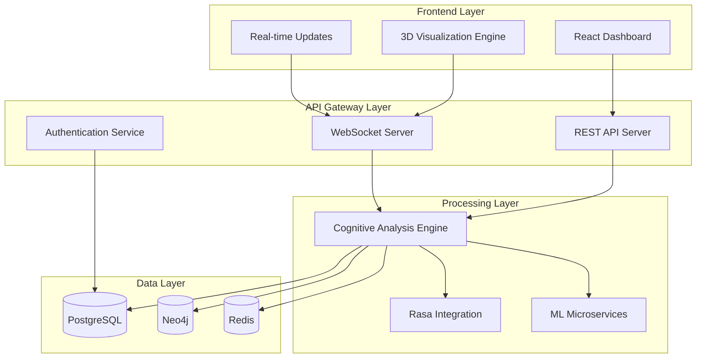

# Architecture Guide - Cognitive Fabric Visualizer

## System Overview

The Cognitive Fabric Visualizer is a sophisticated system that transforms conversational data into multi-dimensional cognitive visualizations. The architecture follows a microservices approach with real-time processing capabilities and high-performance rendering.

## High-Level Architecture



## Core Components

### 1. Frontend Layer

**React Dashboard**: Main user interface providing cognitive visualization controls and data exploration tools.

**3D Visualization Engine**: High-performance rendering using WebGL/Three.js for complex cognitive graph visualization at 120-240 FPS.

**Real-time Updates**: WebSocket-based live updates for dynamic cognitive analysis streaming.

### 2. API Gateway Layer

**Authentication Service**: JWT-based secure authentication with role-based access control.

**REST API Server**: Express.js-based API providing cognitive analysis endpoints, data management, and system configuration.

**WebSocket Server**: Real-time communication for live cognitive analysis and collaborative features.

### 3. Processing Layer

**Cognitive Analysis Engine**: Core ML-powered engine decomposing conversations into four cognitive dimensions:
- Factual Retrieval (92% accuracy target)
- Logical Inference (85% precision target)
- Creative Synthesis (0.60 ROUGE-L target)
- Meta-Cognition (0.96 F1-score target)

**Rasa Integration**: Dialogue processing and intent recognition for conversation segmentation.

**ML Microservices**: Specialized microservices for ensemble LLM coordination, neuro-symbolic processing, and confidence scoring.

### 4. Data Layer

**PostgreSQL**: Primary database for user data, metadata, and structured cognitive analysis results.

**Neo4j**: Graph database for storing cognitive relationships, thread connections, and dynamic graph structures.

**Redis**: High-performance caching layer for session data, real-time updates, and ML model caching.

## Technical Architecture

### API Gateway Architecture

The API Gateway provides unified access to all system services with:
- **Authentication & Authorization**: JWT tokens with role-based permissions
- **Rate Limiting**: Configurable request throttling and abuse prevention
- **Request Routing**: Intelligent routing to appropriate microservices
- **Response Caching**: Redis-based caching for improved performance

### Data Layer Architecture

**PostgreSQL Schema**:
```sql
users (id, username, email, created_at)
conversations (id, user_id, title, created_at)
cognitive_elements (id, conversation_id, type, content, confidence)
analysis_results (id, conversation_id, metrics, created_at)
```

**Neo4j Graph Schema**:
```
(:CognitiveElement)-[:RELATES_TO]->(:CognitiveElement)
(:CognitiveElement)-[:PART_OF]->(:Conversation)
(:User)-[:OWNS]->(:Conversation)
```

**Redis Cache Structure**:
- Session storage: `session:{session_id}`
- Analysis cache: `analysis:{conversation_hash}`
- Real-time updates: `updates:{conversation_id}`

### Frontend Architecture

**Component Structure**:
- `Dashboard/`: Main visualization interface
- `CognitiveGraph/`: 3D graph visualization component
- `AnalysisPanel/`: Cognitive analysis results display
- `RealTimeFeed/`: Live analysis streaming component

**State Management**:
- Redux for global application state
- WebSocket integration for real-time updates
- Local state for component-specific data

## Performance Characteristics

### Processing Performance
- **Input Processing**: <2 seconds for 10-minute conversations
- **Cognitive Decomposition**: <5 seconds per conversation
- **Graph Generation**: <3 seconds for 100-node graphs
- **API Response Time**: <100ms for 95% of queries

### Visualization Performance
- **3D Rendering**: 240 FPS on high-end hardware (WebGPU)
- **Standard Hardware**: 120 FPS on typical consumer hardware
- **Large Graphs**: Supports 500+ nodes with smooth interaction
- **Real-time Updates**: <50ms latency for live analysis streaming

### System Scalability
- **Concurrent Users**: 100+ simultaneous users
- **Database Connections**: 20 PostgreSQL connection pool
- **Memory Usage**: 16GB RAM for production deployment
- **Storage**: 50GB for conversation data and cognitive graphs

## Security Architecture

### Authentication & Authorization
- **JWT Tokens**: Secure session management with configurable expiration
- **Role-Based Access**: User, admin, and developer roles
- **API Key Management**: Secure API key storage and rotation
- **OAuth Integration**: Support for external authentication providers

### Data Security
- **Encryption**: TLS 1.3 for all network communications
- **Data-at-Rest**: Encrypted database storage
- **Input Validation**: Comprehensive request validation and sanitization
- **Rate Limiting**: Protection against API abuse and DoS attacks

## Deployment Architecture

### Container-Based Deployment
```yaml
services:
  frontend:
    image: cfv-frontend:latest
    ports: ["3000:3000"]

  api-gateway:
    image: cfv-api:latest
    ports: ["3001:3001"]
    depends_on: [postgres, neo4j, redis]

  ml-service:
    image: cfv-ml:latest
    ports: ["8000:8000"]
    depends_on: [postgres, neo4j, redis]
```

### Infrastructure Requirements
- **Minimum**: 4 CPU cores, 16GB RAM, 100GB SSD
- **Recommended**: 8 CPU cores, 32GB RAM, 500GB NVMe SSD
- **Production**: 16 CPU cores, 64GB RAM, 1TB NVMe SSD

### Monitoring & Observability
- **Health Checks**: Comprehensive service health monitoring
- **Performance Metrics**: Real-time performance tracking
- **Error Tracking**: Centralized error logging and alerting
- **Resource Monitoring**: CPU, memory, and storage utilization

## Integration Points

### External API Integrations
- **OpenAI API**: GPT-4 integration for cognitive analysis
- **Anthropic API**: Claude integration for reasoning tasks
- **Rasa Platform**: Custom NLU model integration
- **Knowledge Graphs**: External knowledge base integration

### Data Import/Export
- **Conversation Import**: CSV, JSON, and transcript formats
- **Analysis Export**: JSON, CSV, and visual export formats
- **API Access**: RESTful API for external integrations
- **Webhook Support**: Real-time event notifications

## Development Architecture

### Code Organization
```
src/
├── client/          # React frontend application
├── server/          # Express.js API server
├── ml/              # Python ML services
├── shared/          # Shared utilities and types
└── tests/           # Test suites
```

### Development Workflow
- **Local Development**: Docker Compose with hot reloading
- **Testing**: Unit, integration, and E2E test suites
- **CI/CD**: Automated testing and deployment pipelines
- **Code Quality**: ESLint, TypeScript, and automated code review

This architecture provides a scalable, maintainable foundation for the Cognitive Fabric Visualizer with clear separation of concerns and comprehensive monitoring capabilities.