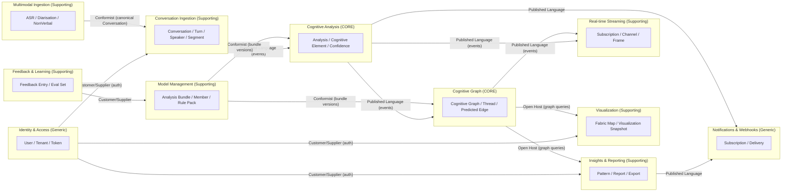

# 03. Strategic Design — Context Map

This document is the **map** of the bounded contexts that make up CFV and
the relationships between them. Use it as the entry point for reasoning
about cross-context features, integration design, and team ownership.

## The Map

## Relationship Patterns Used

We adopt a small, named vocabulary for the relationships:

- **Customer/Supplier.** Downstream depends on upstream; upstream
  considers downstream's needs in evolution.
- **Conformist.** Downstream conforms to upstream's model — used where the
  upstream model is good enough and translation cost is not justified
  (e.g. Multimodal → Ingestion delivers a *canonical* `Conversation`).
- **Published Language.** A stable, versioned event vocabulary or schema
  used for integration. CFV's domain events ([§08](08-domain-events.md))
  are the published language between core contexts.
- **Open Host.** A stable read API exposed to multiple consumers
  (Cognitive Graph publishes a query API consumed by Visualization and
  Insights).
- **Anti-Corruption Layer (ACL).** A translation layer that prevents an
  external model from leaking into our domain
  ([ADR-0017](../adr/0017-anti-corruption-layer-for-llm-providers.md),
  [§12](12-anti-corruption-layers.md)).

## Communication Mechanics

| Mechanic                   | Used between                                                        | Why                                                              |
|----------------------------|---------------------------------------------------------------------|------------------------------------------------------------------|
| In-process function calls  | Within a single bounded context (application → domain → repo).      | Lowest cost, transactional consistency.                          |
| Domain events (in-process) | Bounded contexts deployed in the TS monolith.                       | Decoupling without serialisation cost.                           |
| Domain events (cross-proc) | TS app ↔ Python ML sidecar via Redis Streams + Postgres outbox.     | Avoids dual-write anomalies. See ADR-0012.                       |
| REST / WebSocket           | Bounded contexts ↔ external clients.                                | Documented public surface.                                       |
| ACL adapters               | Any context ↔ external provider (LLM, ASR).                         | Keeps provider drift from leaking in. See ADR-0017.              |

## Integration Rules

These rules are enforced by review and, where possible, by lint
(`dependency-cruiser`, `import-linter` — see ADR-0016):

1. **No reach-around.** A context never imports another context's
   `domain/` or `infrastructure/` — only its `application/` ports.
2. **Events are immutable.** A domain event's payload is part of the
   public contract. Adding a field is fine; renaming/removing requires a
   versioned event ([§08](08-domain-events.md)).
3. **One system of record per fact.** Cross-context replication of a
   fact is permitted as a derived projection, but the upstream context
   remains the source of truth.
4. **No backwards integration.** A core context never calls into a
   supporting context for business decisions; supporting contexts adapt
   to the core's published language.
5. **Authentication is uniform.** Identity & Access is a Customer/Supplier
   to every other context; tokens cross the wire the same way everywhere
   (ADR-0007).

## Team Ownership Sketch

Even with a small team today, naming an owner per context prevents
ambiguity in code review and incident response.

| Bounded Context             | Primary Owner    | Secondary       |
|-----------------------------|------------------|-----------------|
| Identity & Access           | Platform         | Security        |
| Conversation Ingestion      | Backend          | ML              |
| Multimodal Ingestion        | ML               | Backend         |
| Cognitive Analysis          | ML               | Research        |
| Cognitive Graph             | ML               | Backend         |
| Visualization               | Frontend         | Backend         |
| Real-time Streaming         | Backend          | Frontend        |
| Insights & Reporting        | Backend          | Frontend        |
| Model Management            | ML               | Platform        |
| Feedback & Learning         | ML               | Frontend        |
| Notifications & Webhooks    | Platform         | Backend         |

## When to Split a Context

A context should be split when **two of the following** are true:

1. Two distinct ubiquitous-language vocabularies have grown inside it.
2. Two teams contend for the same code paths.
3. The aggregate roots have non-overlapping lifecycles and invariants.
4. The deployment cadence diverges materially.

Splitting is not free; an explicit ADR is required.

## When to Merge Contexts

Merge two contexts when **all of the following** are true:

1. They share a single ubiquitous-language vocabulary.
2. No integration has been needed between them in two release cycles.
3. The combined aggregate set has overlapping invariants.

Merging is also not free; an ADR is required.

## See Also

- [§04 Bounded Contexts](04-bounded-contexts.md) — per-context detail.
- [§05 Subdomains](05-subdomains.md) — investment classification.
- [§08 Domain Events](08-domain-events.md) — the published language.
